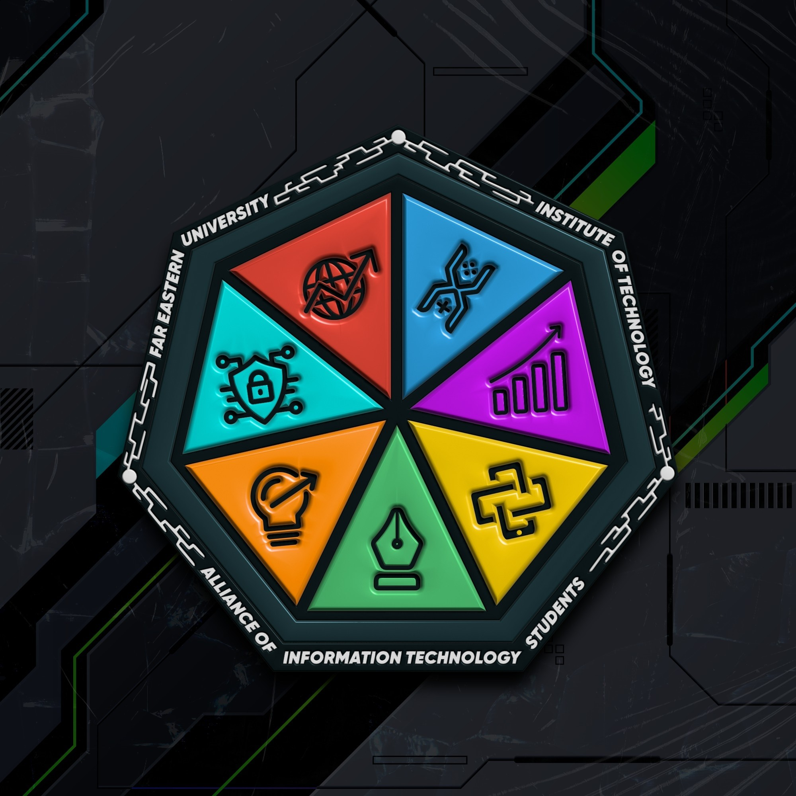

<a name="readme-top"></a>

<br/>

<br />
<div align="center">
  <a href="">
    
  </a>
  <h3 align="center">Advanced Web Design Final Project Backend Starter</h3>
</div>

<div align="center">
  A minimal starter project with API routes using Next.js. ShadCN is installed and ready for optional frontend use.
  <br />
  <strong>For student groups enrolled in Advanced Web Design.</strong>
  <br />
  <strong>Made possible by AITS – Alliance of Information Technology Students, FEU Tech</strong>
</div>

<br />

---

<details>
  <summary>Table of Contents</summary>
  <ol>
    <li>
      <a href="#overview">Overview</a>
      <ol>
        <li><a href="#key-components">Key Components</a></li>
        <li><a href="#technology">Technology Stack</a></li>
      </ol>
    </li>
    <li><a href="#usage">Usage</a></li>
    <li><a href="#installation">Installation</a></li>
    <li><a href="#important-notes">Important Notes</a></li>
    <li><a href="#contributor-list">Contributor List</a></li>
  </ol>
</details>

---

## Overview

This project is a **backend starter kit** for Advanced Web Design finals. It provides the foundation for building RESTful APIs using **Next.js API routes**, and includes **database connections** to Neon (PostgreSQL), MongoDB (optional), and Firebase (optional).

There is **no user interface (UI) included**, but **ShadCN UI is installed and ready** in case you want to build frontend pages.

### Key Components

- ✅ Next.js API Routes preconfigured
- ✅ Neon PostgreSQL connection
- ✅ Optional MongoDB and Firebase setup
- ✅ ShadCN UI pre-installed (but no UI created)
- ❌ No frontend or layout components included
- 🧪 API folder is where you build your group’s assigned logic

### Technology Stack

- 
- 
- 
- 
- 
- 
- 

---

## Usage

This is not a UI template. This repo is primarily for API development and backend logic as part of your finals. You are free to:

- Add your own frontend using ShadCN and Tailwind
- Focus only on APIs if your group is assigned backend routes
- Expand this into a full-stack project

[Click here to use this template](https://scribehow.com/shared/Create_Repository_Based_on_Template_on_GitHub__uqrFu1o3T3iETD9bBMGFlQ?referrer=workspace)

---

## Installation

> Requirements:
> - Node.js (LTS)
> - PostgreSQL via [Neon](https://neon.tech)
> - (Optional) MongoDB Atlas
> - (Optional) Firebase project

```bash
# Step 1: Install dependencies
npm install         # or bun install / yarn install

# Step 2: Run dev server
npm run dev         # or bun dev / yarn dev

# Step 3: Build (optional for deployment)
npm run build       # or bun build / yarn build

# Step 4: Preview (for build preview)
npm run start       # or bun start / yarn start
